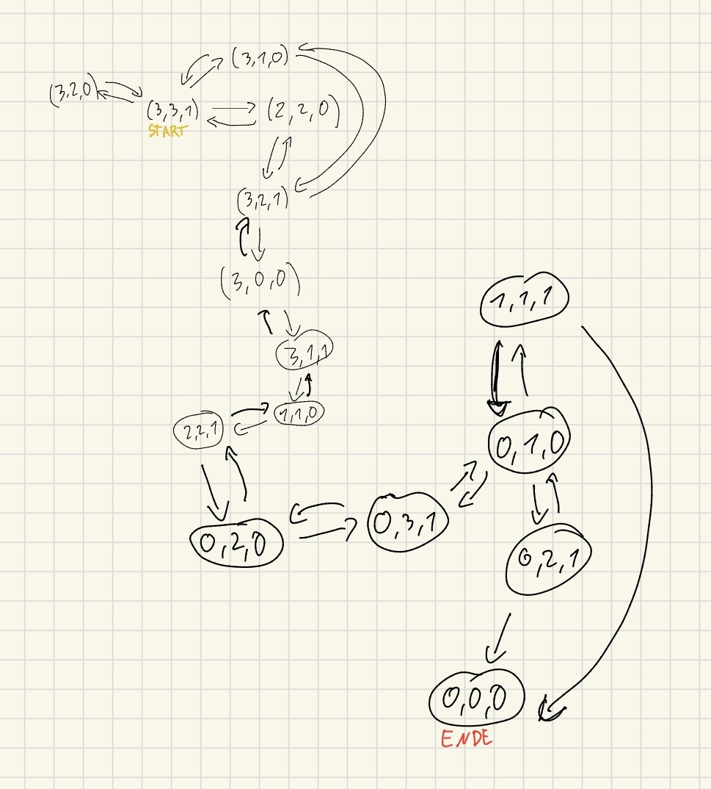

# Aufgabe 1

Wir definieren jeden Zustand als ein Tupel **(E, O, P)**,  
wobei  
- **E** die Anzahl der *Elben*,  
- **O** die Anzahl der *Orks* und  
- **P** die Anzahl der *Pferde*  
auf der **Startseite** angibt.  

Der Pferdezustand **P = 1** bedeutet, dass sich das Pferd auf der Startseite befindet,  
**P = 0** bedeutet, dass es auf der Zielseite ist.

Damit gilt:  
- **Startzustand:** (3, 3, 1)  
- **Zielzustand:** (0, 0, 0)

---
