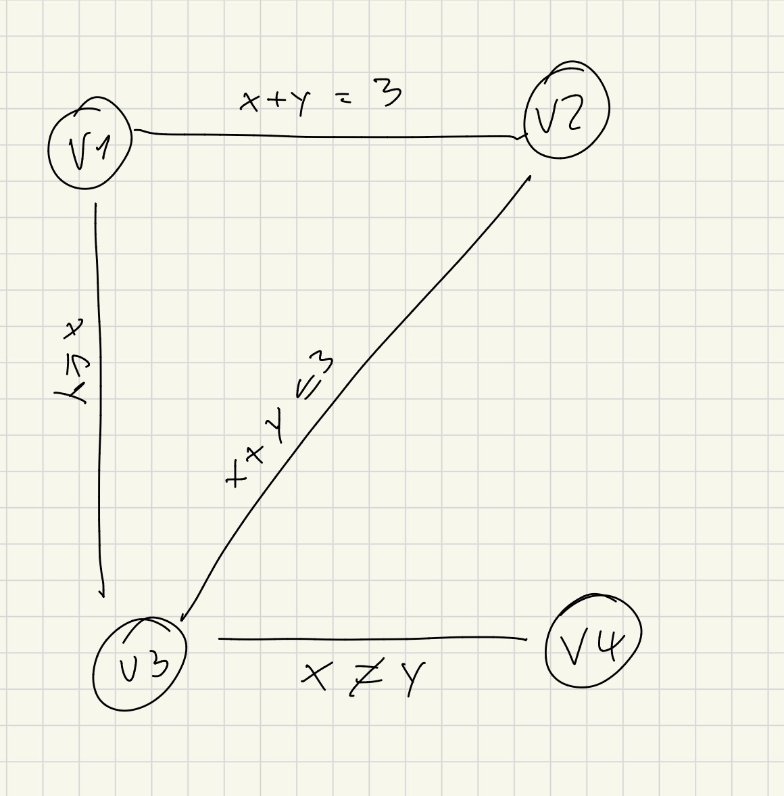

# 1.

Sei D = {1,2,3,4,5} und ein Constraint-Problem definiert durch
< V, {D_v}_{v in V}, C >

mit

V = V_F ∪ V_N ∪ V_G ∪ V_Z ∪ V_H

V_F = {F_rot, F_gruen, F_weiss, F_gelb, F_blau}
V_N = {N_engl, N_span, N_ukr, N_norw, N_jap}
V_G = {G_kaffee, G_tee, G_milch, G_osaft, G_wasser}
V_Z = {Z_oldgold, Z_kools, Z_chester, Z_lucky, Z_parl}
V_H = {H_hund, H_schneck, H_fuchs, H_pferd, H_zebra}

D_v = D für alle v in V

All-different-Constraints (jede Kategorie):

Für jede Kategorie K in {V_F, V_N, V_G, V_Z, V_H}:
C_K = { ((v,w), {(x,y) in D^2 | x != y}) | v,w in K und v != w }
also ist die Menge C_K eine Menge von constraints die angibt das keine zwei eigenschaften der selben kategorie der selben hausnummr zugeordnet werden können.

Einzelne Constraints entsprechend den Hinweisen (jeweils vom Typ c_i = ((v1,v2), {…})):

c1  = ((N_engl,  F_rot),        {(x,y) in D^2 | x = y})  
c2  = ((N_span,  H_hund),       {(x,y) in D^2 | x = y})  
c3  = ((G_kaffee,F_gruen),      {(x,y) in D^2 | x = y})  
c4  = ((N_ukr,   G_tee),        {(x,y) in D^2 | x = y})  
c5  = ((F_gruen, F_weiss),      {(x,y) in D^2 | x = y + 1})  
c6  = ((Z_oldgold,H_schneck),   {(x,y) in D^2 | x = y})  
c7  = ((Z_kools, F_gelb),       {(x,y) in D^2 | x = y})  
c8  = ((Z_chester,H_fuchs),     {(x,y) in D^2 | |x - y| = 1})  
c9  = ((Z_kools, H_pferd),      {(x,y) in D^2 | |x - y| = 1})  
c10 = ((Z_lucky, G_osaft),      {(x,y) in D^2 | x = y})  
c11 = ((N_jap,   Z_parl),       {(x,y) in D^2 | x = y})  
c12 = ((N_norw,  F_blau),       {(x,y) in D^2 | |x - y| = 1})  

Unäre Constraints:

c13 = (G_milch, {3})
c14 = (N_norw,  {1})

Die Constraintmenge C besteht aus allen C_K (für die Kategorien) und den Constraints c1, …, c14.

# 2.

### Standard BT
Loesung gefunden: True
Knoten: 383
Zeit: 0.002142343999366858

### BT mit MRV + Gradheuristik
Loesung gefunden: True
Knoten: 68
Zeit: 0.005408654000348179

### AC3 vor BT_MRV
Loesung gefunden: True
Knoten (BT_MRV nach AC3): 59
Zeit (inkl. AC3): 0.004731451000225206

### Min-Conflicts
Loesung gefunden: False
Zeit: 0.6461081329998706

### Endergebnis
 - Loesungen BT und BT_MRV gleich? True
 - Wer trinkt Wasser?   : N_norw
 - Wem gehört das Zebra?: N_jap

 # 3.

| Step | result (Domains)                  | Queue                                                                                  | Änderung? |
|------|-----------------------------------|----------------------------------------------------------------------------------------|-----------|
| 0    | ([0-5],[0-5],[0-5],[0-5])         | (v1,v2,c1), (v2,v1,c1), (v2,v3,c2), (v3,v2,c2), (v1,v3,c3), (v3,v1,c3), (v3,v4,c4), (v4,v3,c4) | -         |
| 1    | ([0-3],[0-5],[0-5],[0-5])         | (v2,v1,c1), (v2,v3,c2), (v3,v2,c2), (v1,v3,c3), (v3,v1,c3), (v3,v4,c4), (v4,v3,c4), (v3,v1,c3) | v1 geändert |
| 2    | ([0-3],[0-3],[0-5],[0-5])         | (v2,v3,c2), (v3,v2,c2), (v1,v3,c3), (v3,v1,c3), (v3,v4,c4), (v4,v3,c4), (v3,v1,c3), (v3,v2,c2) | v2 geändert |
| 3    | ([0-3],[0-3],[0-5],[0-5])         | (v3,v2,c2), (v1,v3,c3), (v3,v1,c3), (v3,v4,c4), (v4,v3,c4), (v3,v1,c3), (v3,v2,c2)             | -         |
| 4    | ([0-3],[0-3],[0-3],[0-5])         | (v1,v3,c3), (v3,v1,c3), (v3,v4,c4), (v4,v3,c4), (v3,v1,c3), (v3,v2,c2), (v1,v3,c3), (v4,v3,c4) | v3 geändert |
| 5    | ([0-3],[0-3],[0-3],[0-5])         | (v3,v1,c3), (v3,v4,c4), (v4,v3,c4), (v3,v1,c3), (v3,v2,c2), (v1,v3,c3), (v4,v3,c4)             | -         |
| 6    | ([0-3],[0-3],[0-3],[0-5])         | (v3,v4,c4), (v4,v3,c4), (v3,v1,c3), (v3,v2,c2), (v1,v3,c3), (v4,v3,c4)                         | -         |
| 7    | ([0-3],[0-3],[0-3],[0-5])         | (v4,v3,c4), (v3,v1,c3), (v3,v2,c2), (v1,v3,c3), (v4,v3,c4)                                     | -         |
| 8    | ([0-3],[0-3],[0-3],[0-5])         | (v3,v1,c3), (v3,v2,c2), (v1,v3,c3), (v4,v3,c4)                                                 | -         |
| 9    | ([0-3],[0-3],[0-3],[0-5])         | (v3,v2,c2), (v1,v3,c3), (v4,v3,c4)                                                             | -         |
| 10   | ([0-3],[0-3],[0-3],[0-5])         | (v1,v3,c3), (v4,v3,c4)                                                                         | -         |
| 11   | ([0-3],[0-3],[0-3],[0-5])         | (v4,v3,c4)                                                                                     | -         |
| 12   | ([0-3],[0-3],[0-3],[0-5])         | []                                                                                            | - (fertig) |

---
# 4 

**Kantenkonsistenz in α = {v1→2}**

Vorher:  
D1={2}, D2=D3=D4={0..5}

Nachher:  
c1: 2+v2=3 → D2={1}  
c3: 2≤v3 → D3={2,3,4,5}  
c2: 1+v3≤3 → D3={2}  
c4: v3≠v4 → D4={0,1,3,4,5}

Ergebnis KK:  
D1={2}, D2={1}, D3={2}, D4={0,1,3,4,5}

---

**Forward Checking in α = {v1→2}**

Nur Nachbarn von v1:  
c1: 2+v2=3 → D2={1}  
c3: 2≤v3 → D3={2,3,4,5}

Ergebnis FC:  
D1={2}, D2={1}, D3={2,3,4,5}, D4={0..5}

# 5

